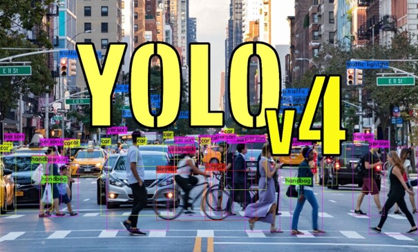

# yolov4-mimarisini-kullanarak-nesne-tanima-object-deteion-

<big>Custom dataset oluştrurarak nesne tanıma</big>

  Diyelim ki elimzide bir nesne var ve bizim yapmak istediğimiz şey ise bu nesneyi kameramız algıladığı zaman terminalde bir komut döndürmesi.
Bunu yapmak için görüntü işlem algoritmalarını kullanmalıyız . İsterseniz görüntü işlemin ne olduğuna değinelim. Görüntü işleme algoritmaları, dijital görüntülerdeki pikseller üzerinde işlem yaparak, görüntülerin iyileştirilmesi, analizi, sıkıştırılması, tanınması gibi birçok amaçla kullanılan matematiksel işlemlerdir. Görüntü işleme algoritmaları, genellikle dijital görüntülerin analizi için kullanılan çeşitli işlemleri içerir. Bunlar arasında görüntü iyileştirme, filtreleme, kenar algılama, nesne tanıma, yüz tanıma, renk düzeltme, özellik çıkarma ve desen tanıma gibi işlemler yer alabilir. 
Şimdi ise datasetimizi oluşturalım : 

1- Öncelikle labelimg programını indirelim  
programın buradan indirebilirsiniz: https://github.com/heartexlabs/labelImg 

2-Programı açıp dataset oluşturacağımız tüm fotoğrafları bir klasöre toplayalım ve programdan open dir diyerek klasörü açalım
Şimdi ise tüm fotoğrafları tek tek etiketlemeniz lazım ( programın sol tarafından pascal yazan kısmı değiştirip yolo yapalım)
Etiketlemeden sonra ise nesnenin class isimlerinin aynı olmasına dikkat edin. 

3- Şimdi ise oluşturduğumuz dataseti görüntü işlem algortimalarından en yaygın kullanılan yolo yu kullanarak training yapacağız.
Ama öncesinde Yolo ya biraz değinmek istiyorum : 

  Yolo, end-to-end bir CNN (Convolutional Neural Network) mimarisi kullanır ve tüm nesne tespiti işlemini bir kez yapar. Bu, ağın hızlı ve gerçek zamanlı nesne tespiti yapabilmesini sağlar. Yolo, çıktı katmanında tüm nesnelerin sınıfının, konumunun ve boyutunun olasılıklarını verir. Bu olasılıklar daha sonra eşik değerleri ile karşılaştırılır ve belirli bir eşik değerinin altındaki nesneler reddedilir. Kalan nesnelerin sınıfı, konumu ve boyutu kullanıcıya sunulur. Yolo yu dezavantaj olarak görebileceğimiz nokta ise diğer nesne tespit algoritmalarına göre daha az doğruluk değerine sahip olmasıdır. 

4- Şimdi eğitime geçebiliriz. Eğitimimizi google nin bir aracı olan Colab de yapacağız. Bunun sebebi ise Colabin bize ücretsiz sunmuş olduğu cpu desteğidir.
https://colab.research.google.com/drive/1hQO4nOoD6RDxdbz3C1YSiifTsyZjZpYm?usp=sharing Linkine giderek bu notebookun bir kopyasını drive'a kaydedidiyoruz daha sonra bizden istediği adımları tek tek uyguluyoruz (Eğitim 2 saate yakın sürebilir) 

5-Adımları doğru bir şekilde takip ettiyseniz drive'ınızda .cfg ve .weights uzantılı iki dosya bulacaksınız bunları indirip bir klasöre alalım. 

6-objectdeteion.py isimli dosyayı indirip oluşturduğumuz klasöre alalım ve kodumuzu çalıştıralım. 

Not: Kodda bulunan, weights ve cfg dosyalarını tanımladığımız kısımda dosya isimleri tam adıyla yazılmalıdır bunu değiştirmeniz gerekebilir.
